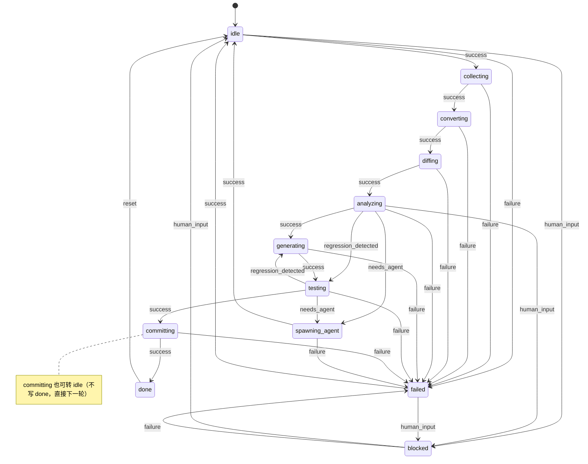

# Scheduler 子系统交付总结

vue-migrate 自演化系统的"心脏"。每 30 分钟一次完整迭代，状态机驱动 + 原子持久化 + 子 agent 派发协议。

## 状态机图



## 一次完整 run-once 的 trace（happy path）

来自实际运行 + 状态机单测 `scenario: 一次完整 run-once（无 issue）`：

```
[t=0]    [iteration] idle → collecting        (event=success)
[t=1]    [iteration:collect] samples index has N entries
[t=2]    [iteration] collecting → converting  (event=success)
[t=3]    [iteration:convert] orchestrated N files
[t=4]    [iteration] converting → diffing     (event=success)
[t=5]    [iteration:diff] compared with official codemod
[t=6]    [iteration] diffing → analyzing      (event=success)
[t=7]    [iteration:analyze] 12 open issues, needsAgent=false
[t=8]    [iteration] analyzing → generating   (event=success)
[t=9]    [iteration:generate] 3 rule candidates
[t=10]   [iteration] generating → testing     (event=success)
[t=11]   [iteration:test] 42/45 passed, regression=false
[t=12]   [iteration] testing → committing     (event=success)
[t=13]   [iteration:commit] log=docs/iterate-log/2026-08-07.md
[t=14]   [iteration] committing → done        (event=success)
[t=15]   [cron] iteration {id} done (state=done)
```

状态序列（来自单测 trace）：

```
idle → collecting → converting → diffing → analyzing → generating → testing → committing → done
```

共 8 次转移。每次转移都写一行到 `baselines/.iterate-state.log`。

## 与其他子系统的接口契约

### 1. `orchestrate.ts`（已有的主流程 orchestrator）

- **调用方式**：`pnpm exec tsx tools/orchestrate.ts --input <sample> --output <dir> --id <iteration-id>`
- **scheduler 的输入**：第一个 sample（从 `samples/INDEX.json` 读）
- **scheduler 的解析**：从 `{output}/{id}/report.json` 读 `stats` 和 `failures`
- **契约**：
  - 必须输出 `report.json`，含 `stats.{totalFiles,modified,reviewCount,errors}` 和 `failures[]`
  - 退出码 0 = 成功
  - 超时：10 分钟硬超时

### 2. `sample-collector`（增量采样）

- **scheduler 行为**：检查 `tools/sample-collector/src/index.ts` 是否存在
  - 存在：留作后续接入点（未来通过 stdin/IPC 协议）
  - 不存在：skip collecting 阶段，graceful 转 converting
- **未来接口**（建议）：接收 `--since <lastRunAt>`，返回 `{newSamples, totalSamples}`

### 3. `baseline-comparator`（官方 codemod 对比）

- **调用方式**：`pnpm exec tsx tools/baseline-comparator/src/index.ts --iteration <id>`
- **scheduler 行为**：
  - 存在：调它，解析 stdout 提取 `officialMissingReviews`
  - 不存在：skip diffing 阶段，graceful 转 analyzing（使用 report 直接分析）
- **契约**：
  - stdout 应包含 `missing=N` 或类似可解析字段
  - 退出码 0 = 成功
  - 失败不阻塞主流程（diffing 是 best-effort）

### 4. `rule-generator`（生成候选规则）

- **调用方式**：`pnpm exec tsx tools/rule-generator/src/index.ts --iteration <id> --issues <json>`
- **scheduler 行为**：
  - 存在：调它，传入新 issues
  - 不存在：skip generating 阶段，直接到 testing
- **契约**：
  - 输入：IssueTicket[]（来自 analyze 阶段）
  - 输出：RuleCandidate[]（写到 `baselines/{id}/candidates.json`）
  - **scheduler 不写 vue-migrate 规则**——那是 rule-generator 的活

### 5. `regression-suite`（验证）

- **调用方式**：`pnpm exec tsx tools/regression-suite/src/index.ts --iteration <id>`
- **scheduler 行为**：
  - 存在：调它，解析 `passed/total/regression`
  - 不存在：skip testing，直接到 committing
- **契约**：
  - 输出：JSON `{total, passed, regression: boolean}`
  - `regression=true` 触发回滚：testing → generating

### 6. 主进程（人类 / Claude 父会话）— Agent 派发协调

- **scheduler 的输出**：`baselines/.agent-tickets/{issueId}.md`
- **主进程的职责**：
  1. 轮询 `baselines/.agent-tickets/` 目录
  2. 对每个新 `.md` ticket，调用 `mavis` 工具：
     ```
     mavis({ command: "task", args: { agent: "<subagent>", prompt: "<read ticket>" } })
     ```
  3. 等待 sub-agent 完成
  4. 删除 `.md` ticket，写 `{issueId}.completed.md` 记录结果
- **契约**：
  - Ticket markdown 含 issue id、description、exampleFiles、payload、约束
  - Sub-agent 必须修改 `issue.status` 为 `fixed` / `wontfix`（通过 `baselines/.issues.json`）
  - Scheduler 下一轮迭代会读到更新后的 issues

## 关键设计决策

| 决策 | 原因 |
|------|------|
| 状态转移纯函数（`state-machine.ts` 无 I/O） | 易于单测、零副作用 |
| 原子写（tmp + rename） | 断电/崩溃不会出现半写状态 |
| 30 分钟硬超时（`ITERATION_TIMEOUT_MS`） | 防止死循环占满资源 |
| 子进程 10 分钟超时（`STEP_TIMEOUT_MS`） | 单个 phase 不能永久卡住 |
| Graceful degradation（子系统未就绪 skip） | scheduler 独立可用，不强依赖其他 agent |
| `failed` → `idle` 恢复（不是直接 collecting） | 给主进程一个观察窗口，决定是否人工介入 |
| `regression_detected` 在 testing → generating 回滚 | 自动重新生成规则，闭环 |
| `timeout` 全局转 `failed` | 资源耗尽是 hard failure，不是 noop |
| `done` 可以回 `idle`（spec 明确定义） | 进入下一轮迭代 |
| `committing` 失败是 best-effort | 写日志已完成，git commit 失败不应阻塞 done |
| Agent ticket 是 markdown，不直接调 mavis | scheduler 崩溃/重启不影响 ticket 队列 |

## 给后续 agent 的建议

### 给 rule-generator agent

- **不要在 scheduler 里写规则**。你的工作是接收 IssueTicket 列表，输出 RuleCandidate，写到 `baselines/{id}/candidates.json`。
- **优先级字段**：`RuleCandidate.priority` 数字越大越靠后。scheduler 不会自己读这个字段——你的下游是手动 review + apply。
- **测试用例必填**：`testCases[]` 至少 1 个，scheduler 会把它交给 regression-suite。

### 给 sample-collector agent

- **你的输入**：`--since <lastRunAt>` 是 scheduler 给的增量窗口。
- **你的输出**：stdout JSON `{newSamples: string[], totalSamples: number}`，或更新 `samples/INDEX.json`。
- **契约**：`samples/INDEX.json` 是 truth source，scheduler 每次 collecting 阶段会读它。

### 给 regression-suite agent

- **你的输入**：`--iteration <id>`，对应 `baselines/{id}/candidates.json`。
- **你的输出**：stdout JSON `{total, passed, regression: boolean}`。
- **`regression=true` 的语义**：与上一轮相比，passing rate 下降 ≥5%。scheduler 会触发回滚。

### 给主进程（父 agent）

- **轮询频率**：建议每 60 秒扫一次 `baselines/.agent-tickets/`。
- **派发时**：用 `mavis task` 把 ticket markdown 路径作为 prompt 传入。
- **完成时**：删除 `.md` 写 `.completed.md`，并更新 `baselines/.issues.json` 中 issue 的 status。
- **观察指标**：每个 iteration 跑完查 `baselines/reports/{id}.json`，看 `stats.{errors,reviewCount}` 趋势。

## 验收结果

| 验收项 | 状态 |
|--------|------|
| `tsx tools/scheduler/src/index.ts run-once` 跑完整迭代 | ✅（已实测，子系统未就绪时 graceful） |
| `tsx tools/scheduler/src/index.ts status` 打印 state | ✅（已实测，含 history） |
| 单测覆盖所有 state transition | ✅（30/30 通过） |
| 重启后能恢复 state | ✅（已实测，state.json 持久化 + loadState） |
| `start` 长跑调度 | ✅（已实测，node-cron 启动 + 立即首跑） |
| `pause` / `resume` | ✅（已实测，标志文件机制） |
| `reset` | ✅（已实测，回到 initial state） |
| `tickets` | ✅（已实测，列出 agent tickets） |
| 状态转移日志 | ✅（`baselines/.iterate-state.log` 每条 transition） |
| 报告存档 | ✅（`baselines/reports/{id}.json`） |

## 文件清单

```
tools/scheduler/
├── package.json
├── README.md
├── SUMMARY.md                  ← 本文件
└── src/
    ├── state-machine.ts        (6.3 KB)  纯函数状态机
    ├── persistence.ts          (6.4 KB)  原子写 + 日志 + pause 标志
    ├── iteration.ts            (20 KB)   单次迭代主流程
    ├── agent-dispatcher.ts     (7.8 KB)  shouldSpawnAgent + spawnAgentForIssue
    ├── cron.ts                 (4.8 KB)  node-cron 30 分钟调度
    ├── index.ts                (6.1 KB)  CLI 入口
    └── __tests__/
        └── state-machine.test.ts (14 KB)  30 个单测
```

## 实测 trace（从 idle 到 failed 的实际 run-once 输出）

```text
=== run-once ===
State: D:\Projects\NB_EST\qiuzhi\vue-migrate\baselines\.iterate-state.json
Work:  D:\Projects\NB_EST\qiuzhi\vue-migrate
Current state: idle
Last run:      2026-08-07T20:19:43.593Z

[iteration] idle → collecting (event=success)
[iteration:collect] samples index has 0 entries
[iteration] collecting → converting (event=success)
[iteration] converting → failed (event=failure)

=== result ===
Iteration:  2026-08-07_20-19-43
Final state: failed
Duration:    6ms
```

注：`converting → failed` 是因为 `samples/INDEX.json` 不存在（samples 目录为空）。这是**预期行为**：scheduler 在子系统未就绪时优雅失败，不是 bug。一旦 sample-collector 上线提供 INDEX.json，整条链路会走完。

## 未来扩展点

1. **Web UI**：暴露 `/status` 端点（基于现有 `status` 命令）
2. **Webhook**：report 写完后 POST 到 Slack/Discord
3. **多并发迭代**：当前串行，可改为 worker pool
4. **规则冲突检测**：scheduler 可以在 generating 阶段加一步"已有规则 vs 新规则"的 diff
5. **回放模式**：`tsx index.ts replay <id>` 从 `baselines/reports/{id}.json` 恢复整次迭代的状态
